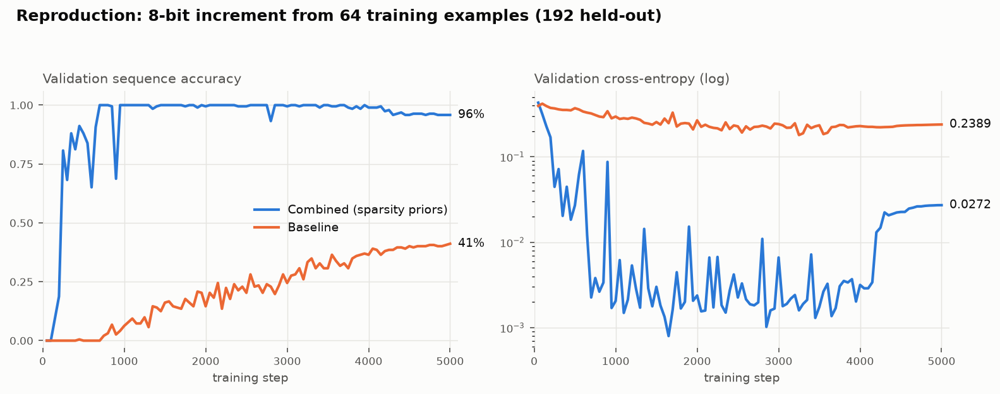

# Focus: scale-invariant priors for data-efficient transformers

This project investigates why transformers become *less* data efficient as they are
scaled up, and proposes an architectural fix: sparsity priors ("focus" vectors) over
depth and width that keep the model's effective complexity bounded as its nominal
size grows.

**Headline result:** on an 8-bit binary increment task, a 4-layer transformer with
layerwise + widthwise focus learns the function from only **64 of the 256 possible
inputs** and generalizes to all **192 held-out inputs**, while an otherwise identical
well-regularized baseline memorizes the training set but reaches only ~15–41%
held-out sequence accuracy.



*Independent reproduction (RTX 3060, PyTorch 2.13, `torch.compile`): validation
sequence accuracy and cross-entropy on the 192 held-out inputs over 5000 full-batch
steps. Combined = focus architecture; Baseline = same skeleton without focus.*

## The theory in one paragraph

Training with the full Bayesian loss `-log p(data|w) - log p(w)` makes the weight
prior explicit. The problem with standard architectures is not the Gaussian weight
prior itself but the **prior over functions** it induces: as depth or width grows, a
fixed i.i.d. Gaussian over ever more parameters puts its mass on ever more complex
functions: the expected effective complexity of a randomly initialized model scales
with model size. That is exactly backwards for generalization: an ideal prior
(compare Solomonoff's universal prior) concentrates on simple hypotheses *regardless
of how the hypothesis space is parameterized*, so its complexity should be constant
with respect to scale. The fix here is architectural: give each layer and each
hidden dimension a learnable focus weight `f = l2normalize(softmax(λ))`, and
penalize the *effective count* `d_eff = 1/Σf⁴` (a soft participation ratio: uniform
focus over n units gives n, focus on one unit gives 1). Under this prior an
arbitrarily deep/wide model still assigns high prior mass to functions that only
*use* a few layers and dimensions, so effective complexity stays bounded as nominal
scale goes to infinity, and depth/width stop being hyperparameters you can get
wrong.

The original, rougher write-up with more detail (including the corrected output
projection that makes L2 regularization meaningful, and the hybrid attention layers
for context-length generalization) is preserved in
[ORIGINAL_NOTES.md](ORIGINAL_NOTES.md). Dataset and loss are specified in
[specs/dataset_spec.md](specs/dataset_spec.md) and
[specs/loss_derivation.md](specs/loss_derivation.md).

## Task

Binary increment with explicit carries, LSB-first, over the vocabulary
`{0, 1, →, C, NC}`: e.g. `111001 → 0C0C0C1NC0NC1NC`. All 256 possible 8-bit inputs
are enumerated; 64 fixed examples (`fixed_train_examples_64_lsb_first.txt`) are the
training set and the complement of 192 is the validation set. The two are disjoint
by construction, so validation accuracy is true generalization to unseen inputs.

## Architectures compared

Both models share the same skeleton (4 layers, d_model 128, single-head hybrid
sliding/full attention, RoPE, RMSNorm), the same seeded initialization for shared
weights, the same custom AdamW (no built-in weight decay), and the same Bayesian
loss: cross-entropy plus a Gaussian weight prior `0.5·Σw²` divided by the dataset
token count.

- **`canonical_baseline`**: the corrected dense transformer, with no layernorm before
  the logit projection (a fixed variance-preserving divisor instead), so the L2
  weight prior stays meaningful. This is a *stronger* baseline than a stock GPT
  under the same regularizer.
- **`canonical_combined`**: the same, plus the layerwise focus scaling each
  sublayer's output and widthwise focus vectors (FocusNorm) before matmuls, with
  the `1/Σf⁴` effective-dimensionality penalty added to the prior. The focus λ
  parameters are exempt from the Gaussian prior (they are regularized through
  d_eff instead).

## Results

| Model | Train seq acc | Val seq acc (192 unseen) | Val token acc | Val CE |
|---|---|---|---|---|
| combined (eager) | 1.000 | **1.000** | 1.000 | 0.0015 |
| combined (`torch.compile`) | 1.000 | **0.958** | 0.997 | 0.027 |
| baseline (`torch.compile`) | 0.969 | 0.411 | 0.943 | 0.239 |
| baseline (eager, original run) | 0.344 | 0.146 | 0.899 | 0.251 |

Validation is teacher-forced, but a val token accuracy of exactly 1.0 implies
greedy autoregressive decoding is also exact.

**Eager vs compiled.** Training is fully deterministic given the execution path
(the eager run reproduces the checked-in metrics bit-for-bit), but `torch.compile`
fuses kernels and reorders float reductions, perturbing results in the last bit
(~1e-8). Full-batch gradient descent at lr 0.03 amplifies this chaotically: the two
runs are identical to 8 decimals at step 100 and fully decorrelated by step ~300.
Both find the generalizing solution and both touch 100% validation accuracy during
training; the compiled run drifts to 95.8% late in the cosine decay. The
combined-vs-baseline gap is robust; the flawless-100% endpoint is
trajectory-sensitive. The transient accuracy dips visible mid-training are
restructuring events, the sparsity prior reshuffling which layers/dimensions the
model commits to; they are not instability of the final solution.

## Reproducing

```bash
pip install torch matplotlib numpy

python3 train.py \
  --fixed-train-file fixed_train_examples_64_lsb_first.txt \
  --num-bits 8 --regularizer-examples 32 \
  --optimizer adamw --learning-rate 0.03 --lr-schedule cosine \
  --train-iterations 5000 \
  --d-model 128 --d-ff 512 --d-attn 128 --num-layers 4 \
  --architectures canonical_combined canonical_baseline \
  --out-dir runs/repro
```

~4 minutes per architecture on an RTX 3060. Add `--compile-mode default` for
`torch.compile` (faster, but see the eager-vs-compiled note above). Metrics stream
to `<out-dir>/<arch>/metrics_live.jsonl`; note checkpoints are written every 50
steps by default (`--checkpoint-every` to reduce).

Ablation sweeps over depth and width (showing the baseline's data efficiency
*degrading* with scale while the focus architecture's does not) are in `runs/` with
plots in `runs/ablation_plots.png`; see `plot_ablations.py`.
